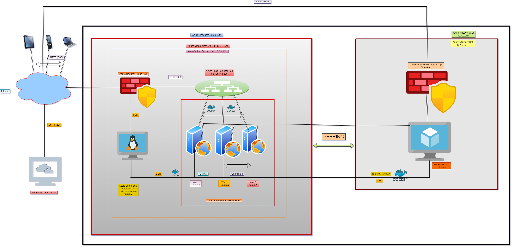
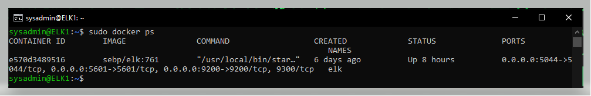

# JKerongo-Azure-Cloud-Security-Kati
<<<<<<< HEAD
Ansible YAML > Cloud Security, Bash Scripts > Linux System Administration Unit.

## Automated ELK Stack Deployment

The files in this repository were used to configure the network depicted below.

These files have been tested and used to generate a live ELK deployment on Azure. They can be used to either recreate the entire deployment pictured above. Alternatively, select portions of the configulation file may be used to install only certain pieces of it, such as Filebeat.

- [ELK Installation](https://github.com/Hephzibah21/JKerongo-Azure-Cloud-Security-Kati/blob/main/ansible/elk.yml)
- [Filebeat & Metrickbeat Installation](https://github.com/Hephzibah21/JKerongo-Azure-Cloud-Security-Kati/blob/main/ansible/Filebeat-%26-Metricbeat.yml) 

This document contains the following details:
- Description of the Topology
- Access Policies
- ELK Configuration
- Beats in Use
- Machines Being Monitored
- How to Use the Ansible Build

### Description of the Topology

- The main purpose of this network is to expose a load-balanced and monitored instance of DVWA, the D*mn Vulnerable Web Application.

- Load balancers ensures that the application will be highly Available, in addition to restricting access to the network. 
- Load balancers conduct continuous health checks on servers to ensure they can handle requests.

- Load Balancers security aspects are:
- Can add additional layers of security to your website without any of your application changes, can minimize the probability of downtime if one server breaks down and
can protect the system from DDoS attacks by shifting attack traffic from the corporate server to a public cloud provider.

- The advantage of a jump box is to give access to the user from a single node that can be secured and monitored. The Jump box (gateway box on the diagram) is a secure VM that all Security Group/Admins first connect to before launching any administrative task/use as the first point to connect to other servers or untrusted environments. This is the only VM/Server which has access to the outside Network that enables the system admin securely connect to the cloud protecting it from direct exposure attack vulnerability. The gateway accepts secure connection only on port 22 using ssh key.

- Integrating an ELK server allows users to easily monitor the vulnerable VMs for changes to the log files and system resouces.
- It also restricts direct access of the web servers from the internet/outside to the network.
- filebeat monitors the log files or locations that you specify, collects log events, and forwards them either to Elasticsearch or Logstash for indexing.
- Metricbeat takes the metrics and statistics that it collects and ships them to the output you specify such as Elasticsearch or Logstash

The configuration details of each machine may be found below.

| Name     | Function              | IP Address | Operating System |
|----------|----------             |------------|------------------|
| Jump Box | Gateway               | 10.0.0.4   |  Linux     |
| Web-1    | Server                | 10.0.0.5   |  Linux     |
| web-2    | Server                | 10.0.0.6   |  Linux     |
| Web-3    | Server                | 10.0.0.7   |  Linux     |
| ELK      | ElasticSearch Stack   | 10.1.0.4   |  Linux     |
### Access Policies

The machines on the internal network are not exposed to the public Internet. 

Only the gateway jumpbox machine can accept connections from the Internet. Access to this machine is only allowed from the following IP addresses:
-  IP addresses: my public IP.

- Machines within the network can only be accessed by ssh using an ssh key and from the gateway VM.

A summary of the access policies in place can be found in the table below.

| Name     | Publicly Accessible | Allowed IP Addresses |
|----------|---------------------|----------------------|
| Jump Box | Yes                 | My public IP Address |
| web-1    | NO                  | 10.0.0.4             |
| Web-2    | NO                  | 10.0.0.4             |
| Web-3    | No                  | 10.0.0.4             |

### Elk Configuration

Ansible was used to automate configuration of the ELK machine. No configuration was performed manually, which is advantageous because the setup is fast, automated and reusable. This enables a rapid deployment of the essential component of the ELK subsystems. Using Ansible also eliminates error and misconfiguration.
- The main advantage is that you can put commands into multiple servers from a single playbook

The playbook implements the following tasks:

- > install: docker.io
- > install: python-pip
- > install: docker
- > Command: sysctl -w vm.max_map_count=262144
- > launch docker container: elk
<<<<<<< HEAD
=======

>>>>>>> 1a53905e8070a9c05e3e7587d27e58793672b2f4
The following screenshot displays the result of running `docker ps` after successfully configuring the ELK instance.

### Target Machines & Beats
This ELK server is configured to monitor the following machines:
- The machines being monitored are: DVWA-VM1 10.0.0.5, VM2 10.0.0.6, VM3 10.0.0.7

We have installed the following Beats on these machines:
- Beats successfully installed Filebeat and Metricbeat

These Beats allow us to collect the following information from each machine:

- Example Winlogbeat collects Windows logs, which we use to track user logon events, etc. Filebeat collects the changes done Metric beat collects metrics and statistics 

### Using the Playbook
In order to use the playbook, you will need to have an Ansible control node already configured. Assuming you have such a control node provisioned: 

SSH into the control node and follow the steps below:
- > Copy the filebeat configuration file to Ansible node.
- > Update the configulation file to include the IP address of the ELK server component you want to send the log to
- > Run the playbook, and navigate to the portal of the ELK servers (web console) to check that the installation worked as expected.

- Which file is the playbook? 

- > Filebeat-&-Metricbeat.yml

- Where do you copy it?

- > /etc/ansible/Filebeat-&-Metricbeat.yml

- Which file do you update to make Ansible run the playbook on a specific machine?

- > The host file on the Ansible machine in the /etc/ansible dir

- How do I specify which machine to install the ELK server on versus which to install Filebeat on? 

- > file the filebeatconfig.ymml and the filebeat-install.yml

- Which URL do you navigate to in order to check that the ELK server is running?

- > www.PublicIP:5601 (Kibana)

 
